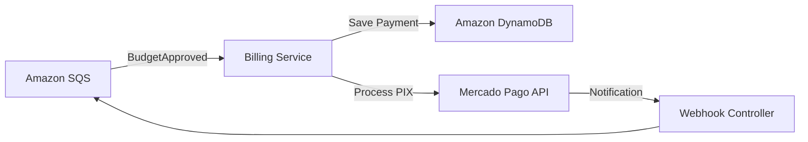
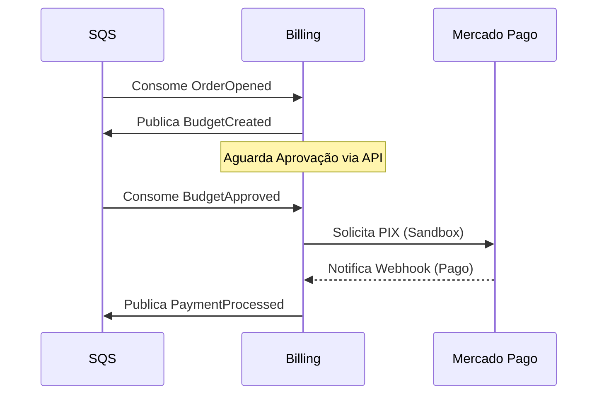

# BillingService - Gestão de Cobrança e Pagamentos

Responsável por gerar orçamentos e processar pagamentos integrados ao Mercado Pago.

## 🛠 Funcionalidades
- Geração automática de orçamentos ao detectar novas ordens.
- Integração com API PIX do Mercado Pago.
- Webhook para recepção de confirmação de pagamento.

## 🏗 Arquitetura

- **Database**: Amazon DynamoDB (NoSQL).

## 🔄 Fluxo da Saga

O BillingService gerencia a parte financeira da SAGA:

- **Integração**: Mercado Pago SDK.
- **Mensageria**: Amazon SQS.

## 🚀 Pipeline
- Build e Testes Unitários.
- Deploy automático no Amazon EKS.
